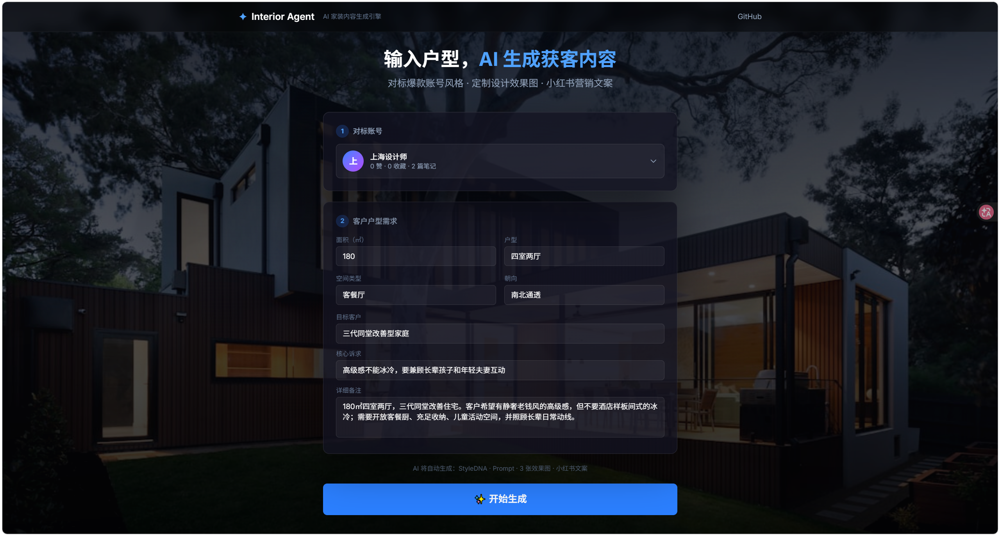

# AI 家装内容生成引擎

> Beyond Prompt: Agents in Action 黑客松项目  
> 输入户型需求与对标账号，自动生成家装设计效果图和可发布的小红书营销文案。



## 项目简介

这是一个面向家装内容生产场景的多 Agent 协作系统。用户只需要选择一个对标小红书账号，并填写户型、面积、客户画像和设计诉求，系统会自动完成：

1. 读取对标账号的历史图文素材
2. 分析账号的视觉风格与文案风格，形成 Style DNA
3. 将用户户型需求转化为设计效果图提示词
4. 生成 3 张家装设计效果图
5. 生成一篇可直接发布的小红书种草文案

目标不是只做一个“生图 demo”，而是把家装内容创作中从选题、风格学习、图像产出到营销表达的链路串成一个可演示的 Agent Pipeline。

## 核心亮点

- **多 Agent Pipeline**：采集样本、风格分析、提示词生成、图片生成、文案生成分工明确。
- **对标账号风格克隆**：从样本账号的历史笔记中提取视觉、构图、色彩、材质和文案表达习惯。
- **图文一体化产出**：一次生成 3 张设计效果图，并配套小红书标题、正文和话题标签。
- **实时过程可视化**：Web 端通过 SSE 展示每个 Agent 的执行状态和中间结果，适合现场路演。
- **可扩展为 Claude Code Skill**：核心链路封装在 `interior-content-skill/`，可复制到本地 skill 目录复用。

## 演示流程

```text
选择对标账号
  → 填写户型需求
  → 风格分析 Agent 提取 Style DNA
  → 提示词 Agent 生成生图 prompt
  → 图片生成 Agent 生成 3 张效果图
  → 文案 Agent 生成小红书成稿
  → Web 端展示最终图文结果
```

## 技术架构

| 模块 | 技术 / 职责 |
|---|---|
| Web 前端 | Vite + React + Tailwind CSS，负责输入表单、Pipeline 可视化、结果展示 |
| API 服务 | FastAPI + SSE，负责串联 Agent 并向前端推送进度 |
| Agent 层 | analyzer / prompter / generator / copywriter 四个核心 Agent |
| LLM | OpenAI-compatible API，用于风格分析、提示词和文案生成 |
| 生图 | OpenAI Images API 兼容接口，用于生成家装效果图 |
| 数据契约 | Pydantic v2 Schemas，约束各 Agent 的输入输出 |

## 快速启动 Web 演示

进入核心项目目录：

```bash
cd interior-content-skill
```

安装依赖：

```bash
python -m pip install -e .
cd web && npm install && cd ..
```

配置环境变量：

```bash
cp .env.example .env
# 编辑 .env，填入 OPENAI_API_KEY 等配置
```

启动后端：

```bash
python -m server.main
```

启动前端：

```bash
cd web
./node_modules/.bin/vite
```

浏览器打开：

```text
http://localhost:5173
```

> 如果项目路径里包含冒号，例如 `Beyond Prompt: Agents in Action`，不要使用 `npm run dev`；npm 会把冒号当作 PATH 分隔符，导致 `vite: command not found`。请直接使用 `./node_modules/.bin/vite`。

## 示例数据

内置对标账号样本位于：

```text
interior-content-skill/examples/collect-sample/
```

目录按账号组织：

```text
examples/collect-sample/<账号>/
└── <单篇笔记>/
    ├── metadata.json
    ├── body.txt
    ├── image_urls.txt
    └── images/
```

当前示例覆盖多个家装 / 设计类账号，可用于现场演示不同账号风格对最终图文生成结果的影响。

## 仓库结构

```text
interior-design-agent/
├── README.md                         # 仓库入口，面向黑客松评委
├── docs/images/main-page.png         # Web 演示首页截图
└── interior-content-skill/            # 核心 Agent Pipeline
    ├── server/                        # FastAPI + SSE 服务
    ├── web/                           # React 前端演示界面
    ├── core/
    │   ├── agents/                    # 风格分析、提示词、生图、文案 Agent
    │   ├── schemas.py                 # Pydantic 数据契约
    │   └── collect_loader.py          # 本地采集样本加载
    ├── tools/                         # LLM / 生图 API 封装
    ├── examples/collect-sample/       # 对标账号样本数据
    └── README.md                      # 核心链路开发与运行说明
```

## 更多文档

- [核心 Agent Pipeline 说明](interior-content-skill/README.md)
- [Web 前端与 API Server 说明](interior-content-skill/web/README.md)

## 当前状态

项目已完成 Web 演示闭环：

- 对标账号选择
- 户型需求输入
- Agent Pipeline 实时进度展示
- Style DNA 中间结果展示
- 3 张设计效果图生成
- 小红书图文成稿展示与复制

适合用于黑客松现场演示“Agent 如何从内容样本中学习风格，并自动完成家装内容生产”。
